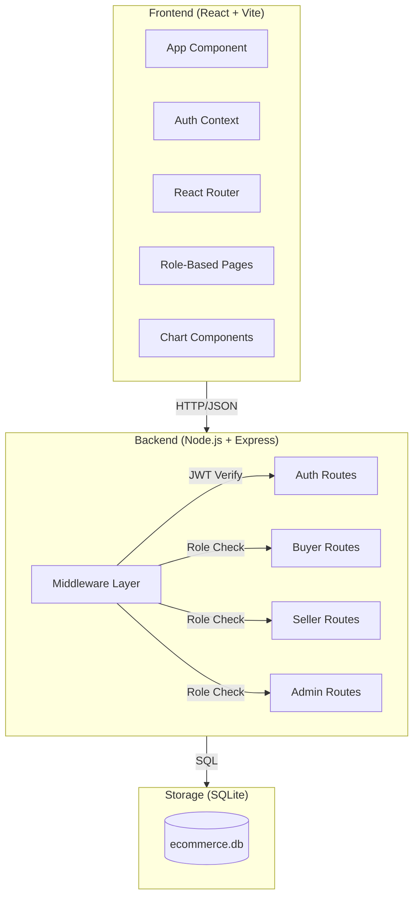
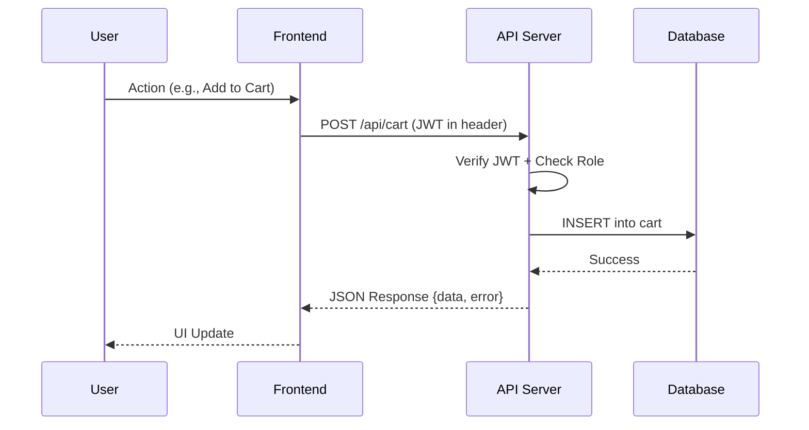
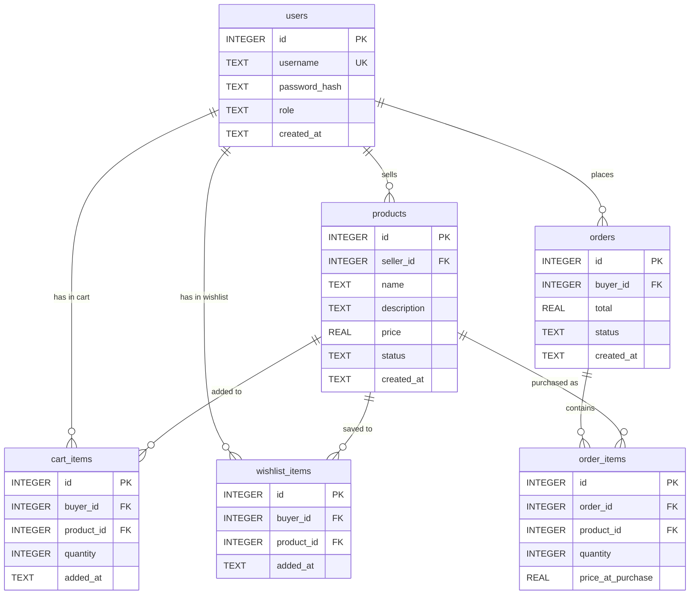

# Design Document: E-Commerce Role Dashboard

## Overview

This design describes a full-stack e-commerce dashboard application with role-based access control. The system uses a React frontend with a Node.js/Express backend, SQLite for persistent storage, and JWT for authentication. Three user roles (Buyer, Seller, Admin) each receive a tailored dashboard with relevant data visualizations, navigation, and functionality.

The architecture prioritizes simplicity and clarity — suitable for a working demo that is easy to set up, run, and explain.

### Key Design Decisions

| Decision | Choice | Rationale |
|----------|--------|-----------|
| Database | SQLite via `better-sqlite3` | Zero-config, file-based, persists across restarts, no external service needed |
| Auth | JWT tokens | Stateless, simple to implement, widely understood |
| Password hashing | bcrypt | Industry standard, built-in salt |
| Charts | Chart.js via `react-chartjs-2` | Lightweight, well-documented, easy to integrate |
| State management | React Context + useReducer | Sufficient for this scale, no extra dependencies |
| HTTP client | Axios | Clean API, interceptors for auth headers |
| Styling | CSS Modules | Scoped styles, no build config needed beyond CRA/Vite |
| Bundler | Vite | Fast dev server, simple config, modern defaults |

## Architecture

The application follows a standard client-server architecture with clear separation between frontend and backend.



### Request Flow



## Components and Interfaces

### Backend Components

#### 1. Express Server (`server.js`)
Entry point that initializes the Express app, applies middleware, mounts route handlers, and starts listening.

#### 2. Database Module (`db/index.js`)
Initializes SQLite connection and runs schema migrations on startup.

```typescript
// Interface
interface Database {
  initialize(): void;  // Creates tables if not exist
  getConnection(): BetterSqlite3.Database;
}
```

#### 3. Auth Middleware (`middleware/auth.js`)

```typescript
interface AuthMiddleware {
  authenticate(req, res, next): void;  // Verifies JWT, attaches user to req
  authorize(...roles: string[]): (req, res, next) => void;  // Checks user role
}
```

#### 4. Route Handlers

| Route Group | Base Path | Role Required |
|-------------|-----------|---------------|
| Auth | `/api/auth` | None (public) |
| Products | `/api/products` | Varies by method |
| Cart | `/api/cart` | Buyer |
| Wishlist | `/api/wishlist` | Buyer |
| Orders | `/api/orders` | Buyer |
| Seller Products | `/api/seller/products` | Seller |
| Admin Users | `/api/admin/users` | Admin |
| Admin Products | `/api/admin/products` | Admin |
| Dashboard Stats | `/api/dashboard` | Authenticated |

#### 5. API Response Format

All API responses follow a consistent structure:

```json
{
  "data": null | object | array,
  "error": null | { "message": "string", "code": "string" }
}
```

### Frontend Components

#### 1. App Shell
- `App.jsx` — Root component with router and context providers
- `AuthContext.jsx` — Provides auth state (user, token, login/logout functions)

#### 2. Layout Components
- `Sidebar.jsx` — Responsive navigation sidebar with role-based menu items
- `Layout.jsx` — Page wrapper with sidebar and content area

#### 3. Page Components

| Page | Route | Role |
|------|-------|------|
| LoginPage | `/login` | Public |
| RegisterPage | `/register` | Public |
| BuyerDashboard | `/dashboard` | Buyer |
| ProductListing | `/products` | Buyer |
| WishlistPage | `/wishlist` | Buyer |
| CartPage | `/cart` | Buyer |
| OrdersPage | `/orders` | Buyer |
| SellerDashboard | `/dashboard` | Seller |
| SellerProducts | `/my-products` | Seller |
| AddProductPage | `/add-product` | Seller |
| AdminDashboard | `/dashboard` | Admin |
| AdminUsers | `/users` | Admin |
| AdminProducts | `/products` | Admin |

#### 4. Shared UI Components
- `Button` — Reusable button with variants (primary, secondary, danger)
- `Card` — Content container with optional title
- `Table` — Data table with column configuration
- `FormInput` — Labeled input with validation display
- `LoadingSpinner` — Loading state indicator
- `ErrorMessage` — Error display with retry button
- `ChartCard` — Wrapper for chart visualizations

#### 5. Route Protection
- `ProtectedRoute.jsx` — Redirects unauthenticated users to login
- `RoleRoute.jsx` — Redirects users to their dashboard if accessing wrong role's routes

### API Endpoints

#### Auth Endpoints

| Method | Path | Description |
|--------|------|-------------|
| POST | `/api/auth/register` | Create new user account |
| POST | `/api/auth/login` | Authenticate and receive JWT |
| POST | `/api/auth/logout` | Invalidate session (client-side) |

#### Buyer Endpoints

| Method | Path | Description |
|--------|------|-------------|
| GET | `/api/products` | List all available products |
| GET | `/api/wishlist` | Get buyer's wishlist |
| POST | `/api/wishlist` | Add product to wishlist |
| DELETE | `/api/wishlist/:productId` | Remove from wishlist |
| GET | `/api/cart` | Get buyer's cart |
| POST | `/api/cart` | Add product to cart |
| PUT | `/api/cart/:itemId` | Update cart item quantity |
| DELETE | `/api/cart/:itemId` | Remove from cart |
| POST | `/api/orders` | Purchase (create order from cart) |
| GET | `/api/orders` | Get buyer's order history |

#### Seller Endpoints

| Method | Path | Description |
|--------|------|-------------|
| GET | `/api/seller/products` | Get seller's own products |
| POST | `/api/seller/products` | Create new product |
| PUT | `/api/seller/products/:id` | Update product |

#### Admin Endpoints

| Method | Path | Description |
|--------|------|-------------|
| GET | `/api/admin/users` | List all users |
| DELETE | `/api/admin/users/:id` | Delete a user |
| GET | `/api/admin/products` | List all products |
| DELETE | `/api/admin/products/:id` | Remove a product |

#### Dashboard Stats Endpoints

| Method | Path | Description |
|--------|------|-------------|
| GET | `/api/dashboard/buyer` | Buyer summary stats |
| GET | `/api/dashboard/seller` | Seller summary stats |
| GET | `/api/dashboard/admin` | Admin summary stats |

## Data Models

### Database Schema



### Table Definitions

#### `users`
| Column | Type | Constraints |
|--------|------|-------------|
| id | INTEGER | PRIMARY KEY AUTOINCREMENT |
| username | TEXT | NOT NULL, UNIQUE |
| password_hash | TEXT | NOT NULL |
| role | TEXT | NOT NULL, CHECK(role IN ('buyer', 'seller', 'admin')) |
| created_at | TEXT | DEFAULT CURRENT_TIMESTAMP |

#### `products`
| Column | Type | Constraints |
|--------|------|-------------|
| id | INTEGER | PRIMARY KEY AUTOINCREMENT |
| seller_id | INTEGER | NOT NULL, FOREIGN KEY → users(id) |
| name | TEXT | NOT NULL |
| description | TEXT | DEFAULT '' |
| price | REAL | NOT NULL, CHECK(price > 0) |
| status | TEXT | DEFAULT 'active', CHECK(status IN ('active', 'sold', 'removed')) |
| created_at | TEXT | DEFAULT CURRENT_TIMESTAMP |

#### `cart_items`
| Column | Type | Constraints |
|--------|------|-------------|
| id | INTEGER | PRIMARY KEY AUTOINCREMENT |
| buyer_id | INTEGER | NOT NULL, FOREIGN KEY → users(id) |
| product_id | INTEGER | NOT NULL, FOREIGN KEY → products(id) |
| quantity | INTEGER | NOT NULL, DEFAULT 1, CHECK(quantity > 0) |
| added_at | TEXT | DEFAULT CURRENT_TIMESTAMP |
| | | UNIQUE(buyer_id, product_id) |

#### `wishlist_items`
| Column | Type | Constraints |
|--------|------|-------------|
| id | INTEGER | PRIMARY KEY AUTOINCREMENT |
| buyer_id | INTEGER | NOT NULL, FOREIGN KEY → users(id) |
| product_id | INTEGER | NOT NULL, FOREIGN KEY → products(id) |
| added_at | TEXT | DEFAULT CURRENT_TIMESTAMP |
| | | UNIQUE(buyer_id, product_id) |

#### `orders`
| Column | Type | Constraints |
|--------|------|-------------|
| id | INTEGER | PRIMARY KEY AUTOINCREMENT |
| buyer_id | INTEGER | NOT NULL, FOREIGN KEY → users(id) |
| total | REAL | NOT NULL |
| status | TEXT | DEFAULT 'completed' |
| created_at | TEXT | DEFAULT CURRENT_TIMESTAMP |

#### `order_items`
| Column | Type | Constraints |
|--------|------|-------------|
| id | INTEGER | PRIMARY KEY AUTOINCREMENT |
| order_id | INTEGER | NOT NULL, FOREIGN KEY → orders(id) |
| product_id | INTEGER | NOT NULL, FOREIGN KEY → products(id) |
| quantity | INTEGER | NOT NULL |
| price_at_purchase | REAL | NOT NULL |


## Correctness Properties

*A property is a characteristic or behavior that should hold true across all valid executions of a system — essentially, a formal statement about what the system should do. Properties serve as the bridge between human-readable specifications and machine-verifiable correctness guarantees.*

### Property 1: Registration round-trip preserves user data

*For any* valid username, password, and role combination, registering a user and then querying the data store should yield a record with the same username and role, and a password_hash that is a valid bcrypt hash not equal to the plaintext password.

**Validates: Requirements 1.2, 11.1, 11.7**

### Property 2: Duplicate username rejection

*For any* username that already exists in the data store, attempting to register a new user with that same username should fail with an error, and the total user count should remain unchanged.

**Validates: Requirements 1.3**

### Property 3: Authentication returns correct role in token

*For any* registered user, logging in with the correct password should return a valid JWT whose decoded payload contains the user's ID and their assigned role.

**Validates: Requirements 1.4**

### Property 4: Invalid credentials are rejected

*For any* registered user and any password that does not match their stored password, login should fail with an authentication error.

**Validates: Requirements 1.5**

### Property 5: Unauthenticated requests receive 401

*For any* protected API endpoint, making a request without a valid JWT in the Authorization header should return a 401 status code.

**Validates: Requirements 2.3**

### Property 6: Wrong-role requests receive 403

*For any* role-restricted API endpoint and any authenticated user whose role does not match the required role, the request should return a 403 status code.

**Validates: Requirements 2.4**

### Property 7: Role-based navigation filtering

*For any* user with a given role, the navigation items rendered should be exactly the set defined for that role and should not include items from other roles.

**Validates: Requirements 2.1**

### Property 8: Cart total equals sum of item prices times quantities

*For any* set of cart items with positive prices and positive quantities, the computed cart total should equal the sum of (price × quantity) for each item.

**Validates: Requirements 3.5**

### Property 9: Purchase creates order and clears cart

*For any* buyer with a non-empty cart, executing a purchase should create an order whose items match the cart contents (same products, quantities, and prices), and the buyer's cart should be empty afterward.

**Validates: Requirements 3.6, 11.4**

### Property 10: Wishlist persistence round-trip

*For any* buyer and any product, adding the product to the buyer's wishlist and then retrieving the wishlist should include that product associated with the correct buyer.

**Validates: Requirements 3.3, 11.2**

### Property 11: Cart persistence round-trip

*For any* buyer and any product, adding the product to the buyer's cart and then retrieving the cart should include that product associated with the correct buyer.

**Validates: Requirements 3.4, 11.3**

### Property 12: Product creation associates with seller

*For any* seller and any valid product data (non-empty name, positive price), creating a product should persist it in the data store with the correct seller_id.

**Validates: Requirements 4.4, 11.5**

### Property 13: Product edit persists new values

*For any* existing product and any valid new values for name, description, and price, submitting an edit should update the product in the data store to reflect the new values.

**Validates: Requirements 4.6**

### Property 14: Admin deletion removes resource

*For any* existing user or product, when an admin deletes it, the resource should no longer be retrievable from the data store.

**Validates: Requirements 5.3, 5.5**

### Property 15: API responses have consistent structure

*For any* request to any API endpoint (valid or invalid), the JSON response body should contain both a `data` field and an `error` field.

**Validates: Requirements 9.2**

### Property 16: Invalid input returns 400 with message

*For any* API endpoint that accepts a request body, submitting a payload that violates validation rules (missing required fields, wrong types, constraint violations) should return a 400 status code with a non-empty error message.

**Validates: Requirements 9.3**

### Property 17: Server errors return generic 500 without internal details

*For any* unexpected server error, the API response should have status 500 and a generic error message that does not contain stack traces, file paths, or internal implementation details.

**Validates: Requirements 9.4**

### Property 18: Dashboard summary stats are accurate

*For any* user role and any set of platform data, the dashboard summary statistics (counts and totals) should match the actual computed values from the underlying data.

**Validates: Requirements 3.1, 4.1, 5.1**

## Error Handling

### Backend Error Handling

| Error Type | HTTP Status | Response |
|------------|-------------|----------|
| Validation error (missing/invalid fields) | 400 | `{ data: null, error: { message: "descriptive message", code: "VALIDATION_ERROR" } }` |
| Authentication failure (no/invalid token) | 401 | `{ data: null, error: { message: "Authentication required", code: "UNAUTHORIZED" } }` |
| Authorization failure (wrong role) | 403 | `{ data: null, error: { message: "Insufficient permissions", code: "FORBIDDEN" } }` |
| Resource not found | 404 | `{ data: null, error: { message: "Resource not found", code: "NOT_FOUND" } }` |
| Duplicate resource (e.g., username) | 409 | `{ data: null, error: { message: "Username already exists", code: "CONFLICT" } }` |
| Unexpected server error | 500 | `{ data: null, error: { message: "Internal server error", code: "INTERNAL_ERROR" } }` |

### Error Handling Strategy

1. **Express error middleware** — A global error handler catches unhandled errors, logs the full error internally, and returns a generic 500 response to the client.
2. **Input validation** — Each route handler validates request body/params before processing. Uses simple validation functions (no heavy library needed for this scope).
3. **Database errors** — Caught at the route handler level. Constraint violations (UNIQUE, CHECK) are mapped to appropriate HTTP status codes.
4. **JWT errors** — The auth middleware catches expired/malformed tokens and returns 401.

### Frontend Error Handling

1. **API error interceptor** — Axios response interceptor catches errors globally. 401 errors trigger logout and redirect to login.
2. **Component-level error state** — Each data-fetching component maintains `loading`, `error`, and `data` states.
3. **Error display** — The `ErrorMessage` component shows the error message and a retry button that re-triggers the failed request.
4. **Optimistic updates** — Not used. All state updates wait for server confirmation to keep things simple.

## Testing Strategy

### Testing Framework

- **Backend**: Jest with supertest for API integration tests
- **Frontend**: Vitest with React Testing Library for component tests
- **Property-based testing**: fast-check (JavaScript PBT library)

### Test Categories

#### Unit Tests (Example-Based)

Focus on specific scenarios and edge cases:

- Registration form renders correct fields (Req 1.1, 1.6)
- Logout clears token and redirects (Req 1.8)
- Unauthenticated redirect to login (Req 1.7)
- Add Product form appears on click (Req 4.3)
- Edit form pre-fills with product data (Req 4.5)
- Chart components render with correct data (Req 6.1, 6.2, 6.3)
- Sidebar responsive behavior at breakpoints (Req 7.1, 7.2)
- Role-specific nav items enumeration (Req 7.4, 7.5, 7.6)
- Loading indicator during fetch (Req 8.1)
- Error message display on failure (Req 8.2)
- Retry button functionality (Req 8.3)

#### Property-Based Tests

Each property test runs a minimum of 100 iterations using fast-check. Each test is tagged with its corresponding design property.

| Property | Test Description | Tag |
|----------|-----------------|-----|
| 1 | Registration round-trip | `Feature: ecommerce-role-dashboard, Property 1: Registration round-trip preserves user data` |
| 2 | Duplicate username rejection | `Feature: ecommerce-role-dashboard, Property 2: Duplicate username rejection` |
| 3 | Auth returns correct role | `Feature: ecommerce-role-dashboard, Property 3: Authentication returns correct role in token` |
| 4 | Invalid credentials rejected | `Feature: ecommerce-role-dashboard, Property 4: Invalid credentials are rejected` |
| 5 | No token → 401 | `Feature: ecommerce-role-dashboard, Property 5: Unauthenticated requests receive 401` |
| 6 | Wrong role → 403 | `Feature: ecommerce-role-dashboard, Property 6: Wrong-role requests receive 403` |
| 7 | Role-based nav filtering | `Feature: ecommerce-role-dashboard, Property 7: Role-based navigation filtering` |
| 8 | Cart total computation | `Feature: ecommerce-role-dashboard, Property 8: Cart total equals sum of item prices times quantities` |
| 9 | Purchase creates order, clears cart | `Feature: ecommerce-role-dashboard, Property 9: Purchase creates order and clears cart` |
| 10 | Wishlist persistence | `Feature: ecommerce-role-dashboard, Property 10: Wishlist persistence round-trip` |
| 11 | Cart persistence | `Feature: ecommerce-role-dashboard, Property 11: Cart persistence round-trip` |
| 12 | Product creation | `Feature: ecommerce-role-dashboard, Property 12: Product creation associates with seller` |
| 13 | Product edit | `Feature: ecommerce-role-dashboard, Property 13: Product edit persists new values` |
| 14 | Admin deletion | `Feature: ecommerce-role-dashboard, Property 14: Admin deletion removes resource` |
| 15 | Response structure | `Feature: ecommerce-role-dashboard, Property 15: API responses have consistent structure` |
| 16 | Invalid input → 400 | `Feature: ecommerce-role-dashboard, Property 16: Invalid input returns 400 with message` |
| 17 | Server error → generic 500 | `Feature: ecommerce-role-dashboard, Property 17: Server errors return generic 500 without internal details` |
| 18 | Dashboard stats accuracy | `Feature: ecommerce-role-dashboard, Property 18: Dashboard summary stats are accurate` |

#### Integration Tests

- Data persists across server restart (Req 11.6)
- Full user flow: register → login → add to cart → purchase → view orders
- RESTful endpoint pattern verification (Req 9.1)

#### Smoke Tests

- Directory structure matches expected layout (Req 10.1)
- README.md contains required sections (Req 10.2)
- Functional components used throughout (Req 10.3)
- AuthContext exists and is used (Req 10.4)
- Shared components exist and are reused (Req 10.5)

### Test Configuration

```javascript
// fast-check configuration for property tests
fc.assert(
  fc.property(/* arbitraries */, (/* generated values */) => {
    // property assertion
  }),
  { numRuns: 100 }
);
```

### Test File Organization

```
backend/
  tests/
    properties/       # Property-based tests
      auth.property.test.js
      cart.property.test.js
      products.property.test.js
      admin.property.test.js
      api.property.test.js
    unit/             # Example-based unit tests
      auth.test.js
      cart.test.js
      products.test.js
    integration/      # Integration tests
      persistence.test.js
      flow.test.js

frontend/
  src/
    __tests__/
      properties/     # Frontend property tests
        navigation.property.test.jsx
        dashboard.property.test.jsx
      components/     # Component unit tests
        Sidebar.test.jsx
        LoginPage.test.jsx
        CartPage.test.jsx
```
